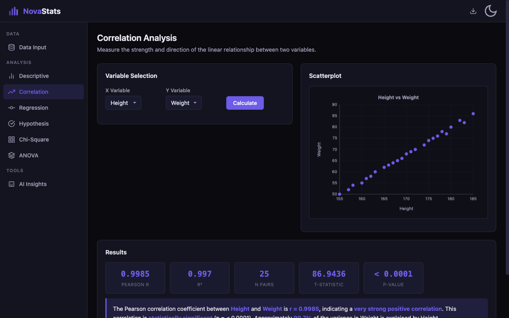
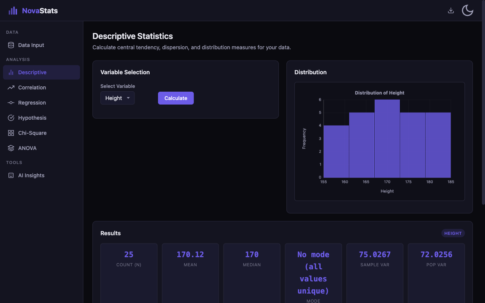
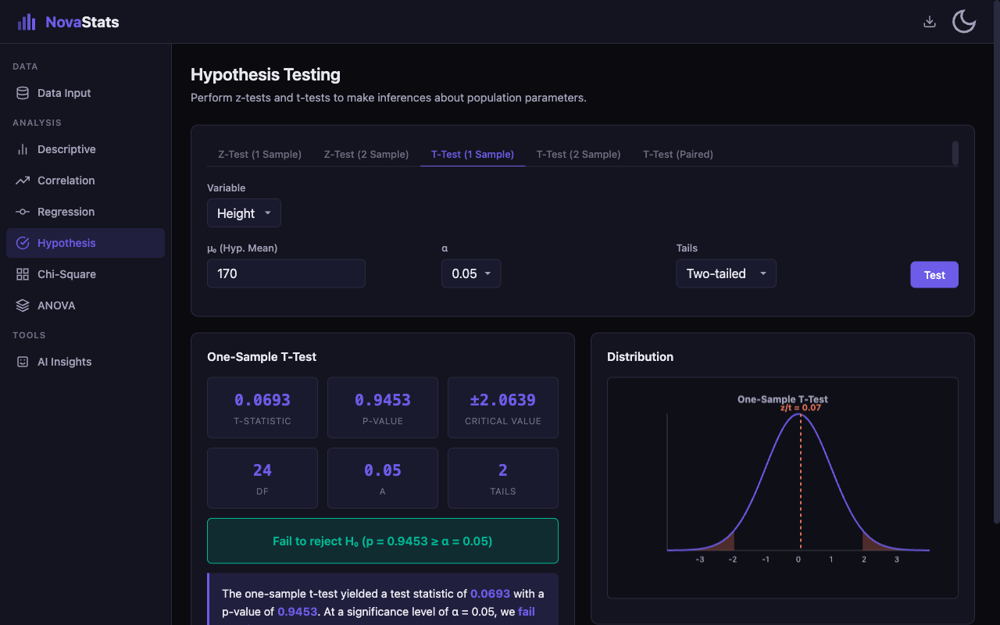

<div align="center">

# NovaStats

[](https://developer.mozilla.org/en-US/docs/Web/HTML)
[](https://developer.mozilla.org/en-US/docs/Web/CSS)
[](https://developer.mozilla.org/en-US/docs/Web/JavaScript)
[](LICENSE)

**A modern, mobile-friendly statistical analysis calculator built with vanilla HTML, CSS, and JavaScript.**

[Live Demo](https://alfredang.github.io/novastats/) · [Report Bug](https://github.com/alfredang/novastats/issues) · [Request Feature](https://github.com/alfredang/novastats/issues)

</div>

---

## Screenshots







---

## About

NovaStats is a comprehensive statistical analysis web application that runs entirely in the browser. No server, no frameworks, no dependencies — just clean HTML, CSS, and JavaScript. It provides professional-grade statistical computations with interactive visualizations, step-by-step calculations, and plain English interpretations.

### Key Features

| Feature | Description |
|---------|-------------|
| **Descriptive Statistics** | Mean, median, mode, variance, standard deviation, quartiles, IQR, and histogram visualization |
| **Correlation Analysis** | Pearson correlation coefficient with scatterplot and significance testing |
| **Linear Regression** | Regression equation, R², regression line chart, and prediction tool |
| **Hypothesis Testing** | One/two-sample z-tests, one/two-sample t-tests, paired t-tests with normal curve visualization |
| **Chi-Square Tests** | Test of independence and goodness-of-fit with observed vs expected comparison charts |
| **One-Way ANOVA** | F-statistic, ANOVA table, effect size (eta-squared), and group comparison bar chart |
| **AI Insights** | Optional OpenAI/Gemini API integration for AI-powered interpretation of results |
| **Dark/Light Theme** | Theme toggle with localStorage persistence |
| **CSV Import/Export** | Paste CSV data or edit an interactive grid; export data and results |
| **Example Datasets** | 4 preloaded datasets covering all module types |
| **Step-by-Step** | Expandable calculation breakdowns for every analysis |
| **Canvas Charts** | Lightweight charts (scatter, histogram, bar, normal curve) with zero dependencies |

---

## Tech Stack

| Category | Technology |
|----------|-----------|
| **Markup** | HTML5 |
| **Styling** | CSS3 (Custom Properties, Flexbox, Grid, Responsive) |
| **Logic** | Vanilla JavaScript (ES6+) |
| **Charts** | HTML5 Canvas API |
| **AI (optional)** | OpenAI API / Google Gemini API |
| **Storage** | localStorage |
| **Hosting** | GitHub Pages |

---

## Architecture

```
┌──────────────────────────────────────────────────┐
│                   Browser (UI)                    │
│  ┌──────────┐  ┌──────────┐  ┌───────────────┐  │
│  │  Header   │  │ Sidebar  │  │ Module Panels │  │
│  │ (theme,   │  │ (nav)    │  │ (6 stat +     │  │
│  │  export)  │  │          │  │  AI insights) │  │
│  └──────────┘  └──────────┘  └───────────────┘  │
├──────────────────────────────────────────────────┤
│               Module Controllers                  │
│  Descriptive │ Correlation │ Regression           │
│  Hypothesis  │ Chi-Square  │ ANOVA                │
├──────────────────────────────────────────────────┤
│               Statistics Engine                   │
│  descriptive.js │ distributions.js │ correlation  │
│  regression.js  │ hypothesis.js    │ chi-square   │
│  anova.js       │                  │              │
├──────────────────────────────────────────────────┤
│  DataManager  │  ChartRenderer  │  AI Insights   │
│  (CSV parse,  │  (Canvas-based  │  (OpenAI /     │
│   grid sync)  │   scatterplot,  │   Gemini API)  │
│               │   histogram,    │                │
│               │   bar, normal)  │                │
└──────────────────────────────────────────────────┘
```

---

## Project Structure

```
novastats/
├── index.html                  # App shell with layout and script imports
├── css/
│   ├── variables.css           # CSS custom properties, dark/light theming
│   ├── base.css                # Reset, typography, scrollbar
│   ├── layout.css              # Header, sidebar, responsive breakpoints
│   ├── components.css          # Cards, buttons, tables, tooltips, toasts
│   └── modules.css             # Charts, results grids, module-specific styles
├── js/
│   ├── config.js               # Constants and configuration
│   ├── state.js                # Application state management
│   ├── utils.js                # DOM helpers, formatting, debounce
│   ├── stats/
│   │   ├── descriptive.js      # Mean, median, mode, variance, stddev
│   │   ├── distributions.js    # Normal, t, chi-square, F CDF approximations
│   │   ├── correlation.js      # Pearson r, covariance
│   │   ├── regression.js       # Simple linear regression, prediction
│   │   ├── hypothesis.js       # Z-tests and t-tests
│   │   ├── chi-square.js       # Independence and goodness-of-fit
│   │   └── anova.js            # One-way ANOVA
│   ├── data.js                 # CSV parsing, grid sync, example datasets
│   ├── charts.js               # Canvas chart renderer
│   ├── modules/
│   │   ├── descriptive.js      # Descriptive stats UI controller
│   │   ├── correlation.js      # Correlation UI controller
│   │   ├── regression.js       # Regression UI controller
│   │   ├── hypothesis.js       # Hypothesis testing UI controller
│   │   ├── chi-square.js       # Chi-square UI controller
│   │   └── anova.js            # ANOVA UI controller
│   ├── ai.js                   # OpenAI / Gemini API integration
│   ├── export.js               # CSV and results export
│   ├── ui.js                   # Navigation, theme toggle, data input panel
│   └── app.js                  # Initialization and event binding
└── screenshots/                # App screenshots for README
```

---

## Getting Started

### Prerequisites

- A modern web browser (Chrome, Firefox, Safari, Edge)
- A local HTTP server (for development)

### Installation

```bash
# Clone the repository
git clone https://github.com/alfredang/novastats.git

# Navigate to the project
cd novastats

# Serve with any HTTP server
python3 -m http.server 8000
# or
npx serve .
```

Then open [http://localhost:8000](http://localhost:8000) in your browser.

### Usage

1. **Load Data** — Paste CSV text, edit the grid, or click an example dataset
2. **Navigate** — Use the sidebar to switch between analysis modules
3. **Compute** — Select variables and click "Calculate" or "Test"
4. **Interpret** — Read the plain English interpretation and expand step-by-step details
5. **Export** — Download data as CSV or results as TXT via the export menu

---

## Statistical Methods

All p-value computations use numerical approximations implemented from scratch:

- **Normal CDF** — Series expansion (Abramowitz & Stegun)
- **t-distribution CDF** — Regularized incomplete beta function (Lentz's continued fraction)
- **Chi-square CDF** — Regularized lower incomplete gamma function
- **F-distribution CDF** — Reduction to incomplete beta function
- **Inverse Normal** — Rational approximation (Peter Acklam)

These provide accuracy to 6+ decimal places, validated against standard statistical tables.

---

## Contributing

Contributions are welcome!

1. Fork the repository
2. Create a feature branch (`git checkout -b feature/new-test`)
3. Commit your changes (`git commit -m 'Add new statistical test'`)
4. Push to the branch (`git push origin feature/new-test`)
5. Open a Pull Request

---

## Acknowledgements

- Statistical formulas and methods based on standard references (NIST, Abramowitz & Stegun)
- UI inspired by [StatsKingdom](https://www.statskingdom.com/) and [Numiqo](https://numiqo.com/)
- Built with vanilla web technologies — zero external dependencies

---

<div align="center">

**If you find NovaStats useful, please consider giving it a star!**

</div>
